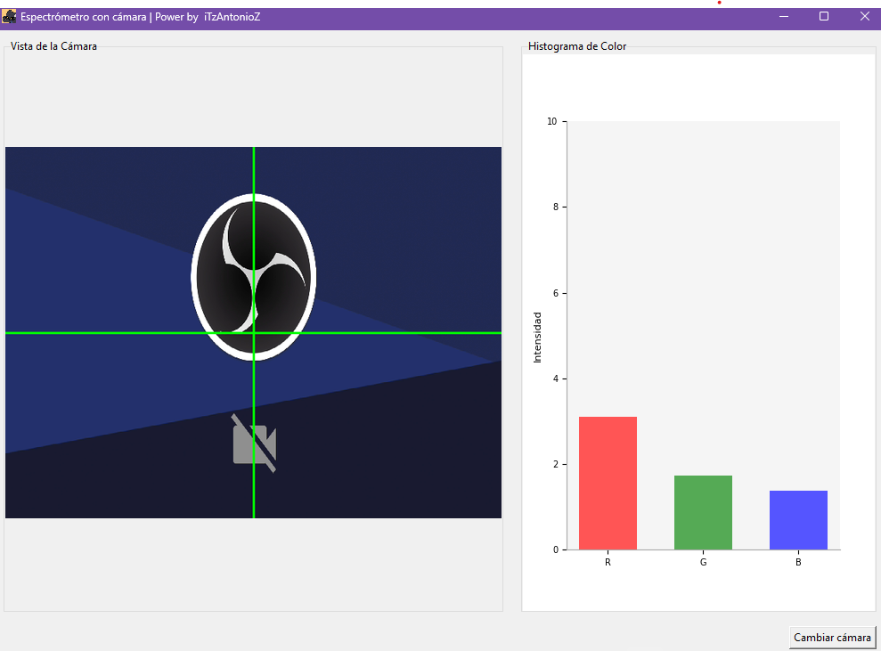

# 📷 Espectrómetro de Colores con Cámara

 <!-- Reemplaza con una imagen real de tu proyecto -->

Un aplicativo que analiza los colores en tiempo real utilizando la cámara de tu dispositivo, mostrando un histograma de los componentes RGB del área central de la imagen.

## ✨ Características

- 🎥 Captura de video en tiempo real con selección de cámara
- 🎨 Análisis de color por cuadrantes y área central
- 📊 Visualización de histograma RGB minimalista
- 🖥️ Interfaz intuitiva con TKinter
- 🔄 Actualización en tiempo real (~60 FPS)

## 📦 Requisitos

- Python 3.8+
- OpenCV (`opencv-python`)
- NumPy
- Pillow (PIL)
- Matplotlib
- TKinter (normalmente incluido con Python)

## 🚀 Instalación

1. Clona el repositorio:

```bash
git clone https://github.com/tu-usuario/espectrometro-camara.git
cd espectrometro-camara
```

2. Instala las dependencias:

```bash
pip install -r requirements.txt
```

## 🏗️ Estructura del Proyecto

```
espectrometro-camara/
├── src/
│   ├── cam.py           # Lógica de análisis de color
│   ├── graph.py         # Visualización del histograma
│   ├── assets/          # Recursos gráficos
│   └── __init__.py
├── index.py             # Aplicación principal
├── requirements.txt     # Dependencias
└── README.md            # Este archivo
```

## 🖥️ Uso

Ejecuta la aplicación principal:

```bash
python index.py
```

### Controles:
- **Cambiar cámara**: Botón para seleccionar entre cámaras disponibles
- **Salir**: Cierra la aplicación correctamente

## 🛠️ Desarrollo

### Ejecutar en modo desarrollo

```bash
python -m src.cam  # Prueba el módulo de cámara directamente
```

### Construir ejecutable (opcional)

```bash
pyinstaller --onefile --windowed index.py
```

## 🤝 Contribución

¡Las contribuciones son bienvenidas! Sigue estos pasos:

1. Haz un fork del proyecto
2. Crea una rama para tu feature (`git checkout -b feature/awesome-feature`)
3. Haz commit de tus cambios (`git commit -m 'Add some awesome feature'`)
4. Haz push a la rama (`git push origin feature/awesome-feature`)
5. Abre un Pull Request

## 📄 Licencia

MIT © [iTAntonioZ]

---

Hecho con ❤️ y Python 🐍